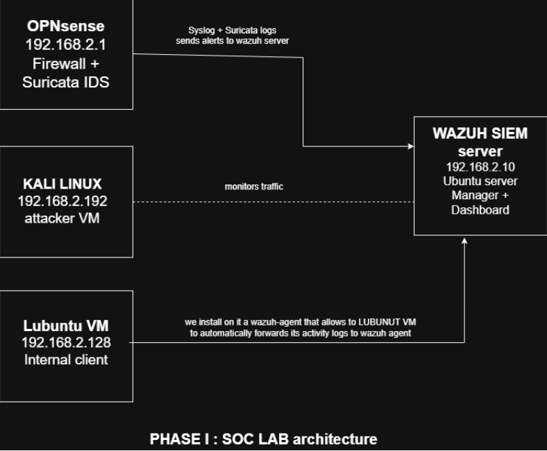
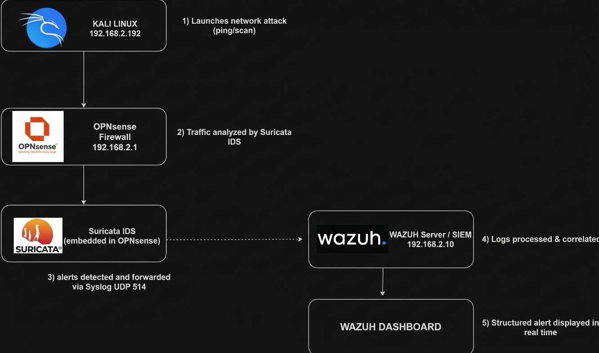

# Open SOC Vanguard : Technical Architecture

This document details the architectural design, node configurations, log ingestion pipeline, and detection workflow for the **Open SOC Vanguard** security monitoring environment.

---

## Network Topology & SOC Lab Architecture

### **Network Nodes & Addressing**

* **OPNsense Firewall + Suricata IDS (`192.168.2.1`):** Perimeter firewall performing inline traffic analysis and streaming Syslog/Suricata logs over UDP port 514.
* **Wazuh SIEM Server (`192.168.2.10`):** Ubuntu Server running the Wazuh Manager, Indexer, and Dashboard for log processing, rule execution, and event correlation.
* **Internal Client Host — Lubuntu VM (`192.168.2.128`):** Target internal endpoint monitored by a local `wazuh-agent` streaming activity logs to the SIEM server.
* **Attacker Host — Kali Linux (`192.168.2.192`):** External/Internal testing platform generating network scans, exploits, and attack telemetry.

---

## Security Alert Processing Pipeline

### **Detection & Ingestion Sequence**

1. **Attack Launch:** Kali Linux (`192.168.2.192`) executes network probes or attack vectors (ping sweeps, port scans...).
2. **Traffic Analysis:** Network packets traverse OPNsense (`192.168.2.1`) where the embedded Suricata IDS evaluates packet signatures.
3. **Log Forwarding:** Detected security alerts are forwarded instantaneously to the Wazuh Server via Syslog over `UDP 514`.
4. **Processing & Correlation:** The Wazuh Manager (`192.168.2.10`) ingests raw events, decodes syslog payloads, matches them against active detection rules, and logs alerts.
5. **Real-time Visualization:** Correlated alerts surface on the Wazuh Dashboard for SOC analysis and active response triggering.
